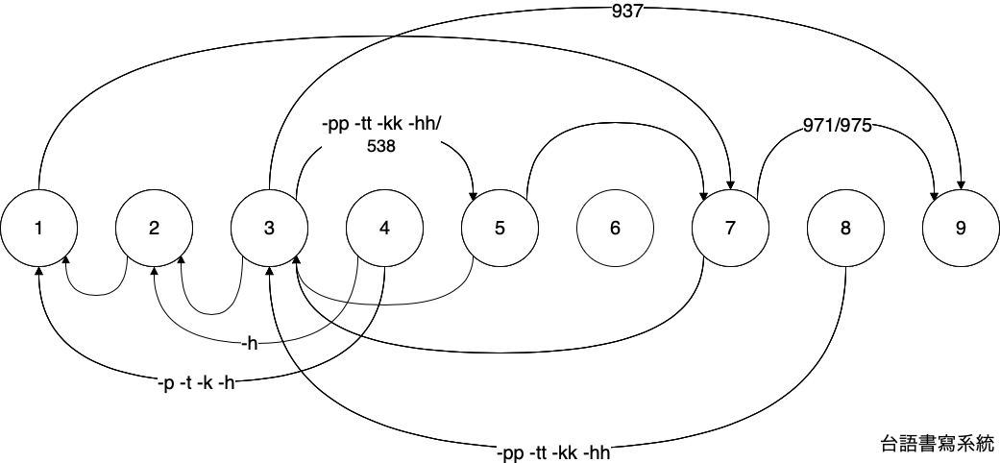
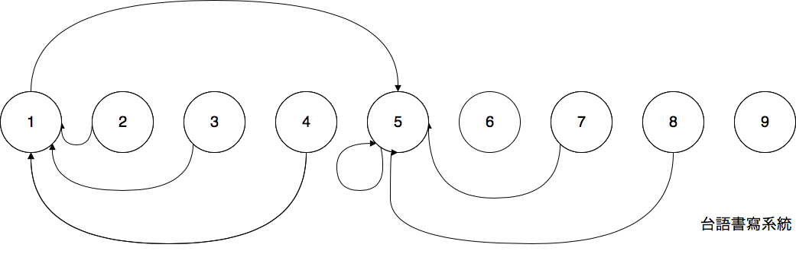

# 變調圖

## 一般變調圖

箭頭

* 頂半 ew 箭頭 long siw uiy 倒平 qauy 正平
* 下半 ew 箭頭 long siw uiy 正平 qauy 倒平

數字

* 1, 2, 3, 4, 5, 6, 7, 8, 9 viau 聲調號碼
* 538 viaucfsiw 第八調 ew 三連音音節調號. 譬喻 qong 白白白 ew 頭一个白 siw 第五調 vehhx, 第二个白 siw 第三調 vehhw, 第三个白 siw 第八調 vehh. Socfi 538 ew 8 viaucfsiw 白 ew 原調, 3 viaucfsiw 第八調 vieny chury 第三調, 5 viaucfsiw 第三調 qurhf vieny chury 第五調, hekkwchiacfsiw qong 第八調 dittwchiappw vieny chury 第五調. 數字 538 siw qaw kngy diw 5-3 ew 連線內, 3-8 bien kngw
* 975 viaucfsiw 第五調 ew 三連音音節調號. 譬喻 qong 紅紅紅 ew 頭一个紅 siw 第九調 angxx, 第二个紅 siw 第七調 angz, 第三个紅 siw 第五調 angx. 所以 9-7-5 ew 5 viaucfsiw 紅 ew 原調, 7 viaucfsiw 第五調 vieny chury 第七調, 9 viaucfsiw 第七調 qurhf vieny chury 第九調, hekkwchiacfsiw qong 第五調 dittwchiappw vieny chury 第九調. 數字 975 qaw kngy diw 97 連線內, 75 免 kngw
* 937 viaucfsiw 第七調 ew 三連音音節調號. 譬喻 qong 大大大 ew 頭一个大 siw 第九調 doaxx, 第二个大 siw 第三調 doaw, 第三个大 siw 第七調 doaz. 所以 937 ew 七 viaucfsiw 大 ew 原調, 3 viaucfsiw 第七調 vieny chury 第三調, 9 viaucfsiw 第三調 qurhf vieny chury 第九調, hekkwchiacfsiw qong 第七調 dittwchiappw vieny chury 第九調. 數字 937 siw qaw kngy diw 93 ew 連線內, 3-7 免 kngw
* 971 viaucfsiw 第一調 ew 三連音音節調號. 譬喻 qong 金金金 ew 頭一个金 siw 第九調 qimxx, 第二个金 siw 第七調 qimz, 第三个金 siw 第一調 qim. 所以 971 ew 1 viaucfsiw 金 ew 原調, 7 viaucfsiw 第一調 vieny chury 第七調, 9 viaucfsiw 第七調 qurhf vieny chury 第五調, hekkwchiacfsiw qong 第一調 dittwchiappw vieny chury 第九調. 數字 971 siw qaw kngy diw 97 連線內, 71 免 kngw

-p -t -k -h/入聲 (輕聲)

* 41 箭頭 ew -p -t -k viaucfsiw 第四調 ew -p -t -k vieny chury 第一調 ew -pf -tf -kf
* 42 箭頭 ew -h viaucfsiw 第四調 ew -h vieny chury 第二調 ew -hy
* 83 箭頭 ew -pp -tt -kk -hh viaucfsiw 第八調 ew -pp -tt -kk -hh vieny chury 第三調 ew -ppw -ttw -kkw -hhw
* 35 箭頭 ew -pp -tt -kk -hh viaucfsiw 第三調 ew -ppw -ttw -kkw -hhw vieny chury 第五調 ew -ppx -ttx -kkx -hhx. hekkwchiacfsiw viaucfsiw 第八調 ew -pp -tt -kk -hh vieny chury 第五調 ew -ppx -ttx -kkx -hhx

連線

* 線內 uw 數字 ez siw 三連音變調
* 線內 burz 數字 ez diurw mw siw 三連音變調

## 仔前變調圖

## 語尾變化圖

