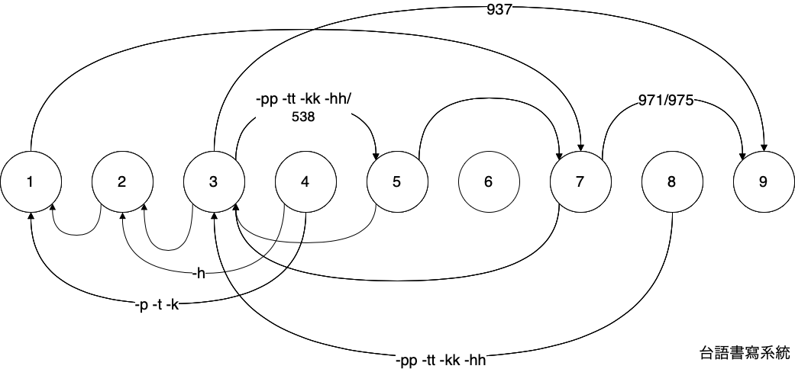
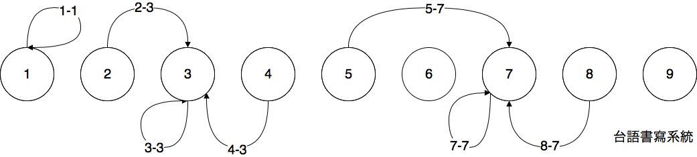

# 變調圖

## 一般變調

### 箭頭

* 頂半 ew 箭頭 long siw uiy 倒平 kauy 正平
* 下半 ew 箭頭 long siw uiy 正平 kauy 倒平

### 數字

* `1`, `2`, `3`, `4`, `5`, `6`, `7`, `8`, `9` piau 聲調號碼
* `538` piaufsiw 第八調 ew 三連音音節調號. 譬喻 kong 白白白 ew 頭一个白 siw 第五調 `pehx`, 第二个白 siw 第三調 `pehw`, 第三个白 siw 第八調 `pehh`. Sofi `538` ew `8` piaufsiw 白 ew 原調, `3` piaufsiw 第八調 pieny chury 第三調, `5` piaufsiw 第三調 kurhf pieny chury 第五調, hekwchiafsiw kong 第八調 titwchiapw pieny chury 第五調. 數字 `538` siw kaw khngy tiw `53` ew 連線內, `38` bien khngw
* `975` piaufsiw 第五調 ew 三連音音節調號. 譬喻 kong 紅紅紅 ew 頭一个紅 siw 第九調 `angxx`, 第二个紅 siw 第七調 `angz`, 第三个紅 siw 第五調 `angx`. 所以 `975` ew `5` piaufsiw 紅 ew 原調, `7` piaufsiw 第五調 pieny chury 第七調, `9` piaufsiw 第七調 kurhf pieny chury 第九調, hekwchiafsiw kong 第五調 titwchiapw pieny chury 第九調. 數字 `975` kaz khngy tiw `97` 連線內, `75` 免 khngw
* `937` piaufsiw 第七調 ew 三連音音節調號. 譬喻 kong 大大大 ew 頭一个大 siw 第九調 `tuaxx`, 第二个大 siw 第三調 `tuaw`, 第三个大 siw 第七調 `tuaz`. 所以 `937` ew `7` piaufsiw 大 ew 原調, `3` piaufsiw 第七調 pieny chury 第三調, `9` piaufsiw 第三調 kurhf pieny chury 第九調, hekwchiafsiw kong 第七調 titwchiapw pieny chury 第九調. 數字 `937` siw kaw khngy tiw `93` ew 連線內, `37` 免 khngw
* `971` piaufsiw 第一調 ew 三連音音節調號. 譬喻 kong 金金金 ew 頭一个金 siw 第九調 `kimxx`, 第二个金 siw 第七調 `kimz`, 第三个金 siw 第一調 `kim`. 所以 `971` ew `1` piaufsiw 金 ew 原調, `7` piaufsiw 第一調 pieny chury 第七調, `9` piaufsiw 第七調 kurhf pieny chury 第五調, hekwchiafsiw kong 第一調 titwchiapw pieny chury 第九調. 數字 `971` siw kaw khngy tiw `97` 連線內, `71` 免 khngw

### `-p`, `-t`, `-k`, `-h`/入聲 (輕聲)

* `41` 箭頭 ew `-p -t -k` piaufsiw 第四調 ew `-p -t -k` pieny chury 第一調 ew `-pf -tf -kf`
* `42` 箭頭 ew `-h` piaufsiw 第四調 ew `-h` pieny chury 第二調 ew `-hy`
* `83` 箭頭 ew `-pp -tt -kk -hh` piaufsiw 第八調 ew `-pp -tt -kk -hh` pieny chury 第三調 ew `-pw -tw -kw -hw`
* `35` 箭頭 ew `-pp -tt -kk -hh` piaufsiw 第三調 ew `-pw -tw -kw -hw` pieny chury 第五調 ew `-px -tx -kx -hx`. hekwchiafsiw piaufsiw 第八調 ew `-pp -tt -kk -hh` pieny chury 第五調 ew `-px -tx -kx -hx`

### 連線

* 線內 uw 數字 ez siw 三連音變調
* 線內 burz 數字 ez tiurw mw siw 三連音變調

## 仔前變調

## 後接語

## 其他

* 第四調助詞 pieny 第一調. Kahf 仔前變調仝欵. 助詞語尾 `-h` maw ew how 後壁 ew 單語同化.
* 第四調助詞 pieny 第三調. 譬喻 kong 句動詞 ew 助詞.
* 第四調助詞 pieny 第一調 iahwsiw 第七調舒聲. 譬喻 kong 句動詞 ew 助詞.

### 第八調

* 第八調 `-pp, -tt, -kk, -hh` pieny 第一調 `-pf, -tf, -kf, -hf`
* 第八調輕聲 `-hh` pieny 第二調 `-hy` hekwchiafsiw `-hx`. Che siw siokw iz 腔口 ew 差別.

### transfix

* Sofuw 音節 pieny 第三調
